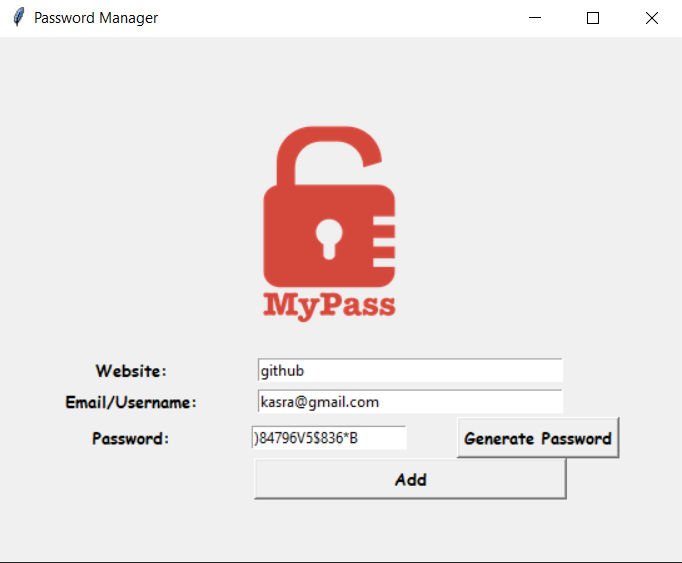

🔐 Password Manager – Python GUI App

This project is a beginner-friendly Password Manager built using Python and Tkinter. It allows users to generate strong passwords, save them securely to a .txt file, and easily retrieve them later.

💻 How It Works

User inputs website and email/username into entry fields.

Click Generate Password to automatically fill the password field with a strong random password.

Click Add to save the entry into a text file (data.txt) in the format.

🖼️ Example Output (data.txt)

Website: github.com | Email: test@example.com | Password: 8a@Kfj12&!

Website: gmail.com  | Email: user123@gmail.com | Password: qW3$erT#z
