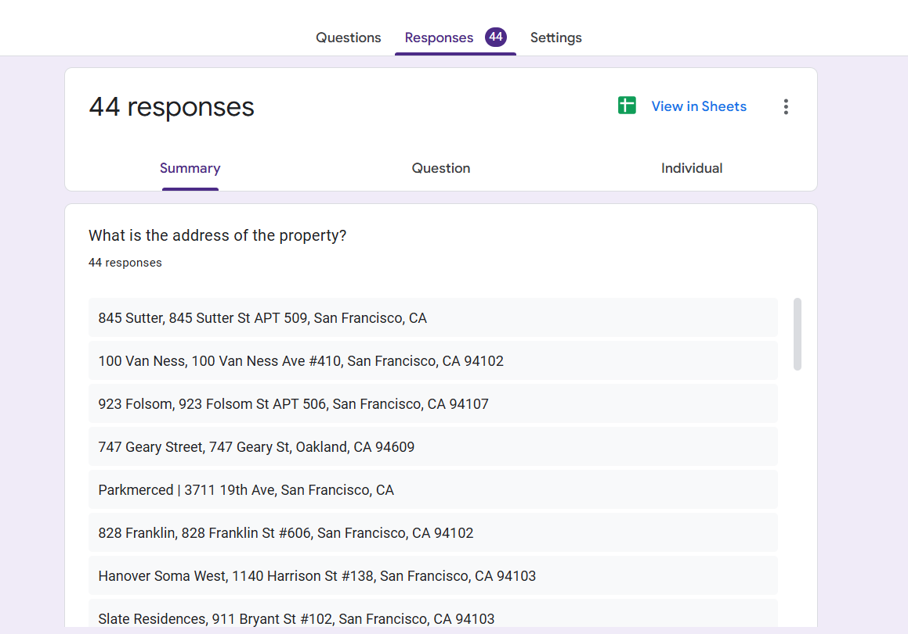
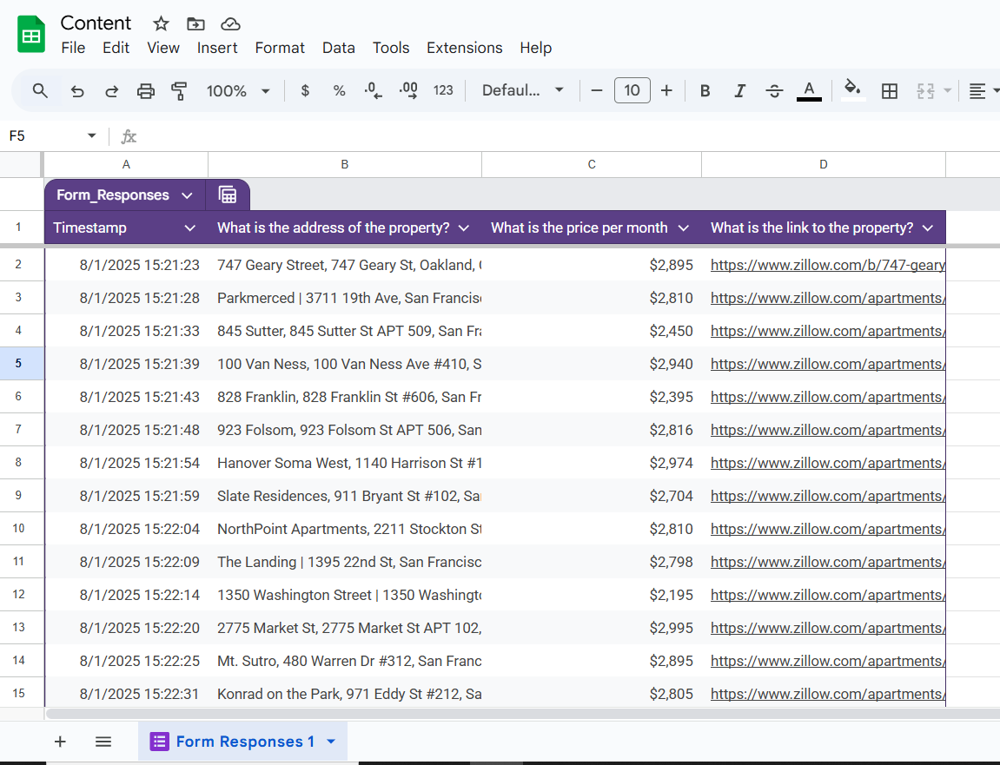

# 🏡 Day 53 - Data Entry Job Automation

On Day 53, I built a script that **scrapes property listings** from a Zillow clone site and **automatically fills out a Google Form** using Selenium.

---

## 🚀 What It Does

✅ Scrapes the following data:

- 🏠 Property Address  
- 💵 Price  
- 🔗 Property Link

✅ Fills out a [Google Form](https://docs.google.com/forms/) automatically with that data.

---

## 🧰 Tools & Technologies

- **Selenium** – browser automation  
- **BeautifulSoup** – HTML parsing  
- **requests** – fetches page content  
- **Google Forms** – data input target  

---

## 📸 Demo

Here are the 44 responses automatically submitted by the bot:

And the respective Google Sheet:

---

## 📅 Part of My Journey

Day 53 of my [#100DaysOfCode](https://www.100daysofcode.com/) Python Bootcamp!

