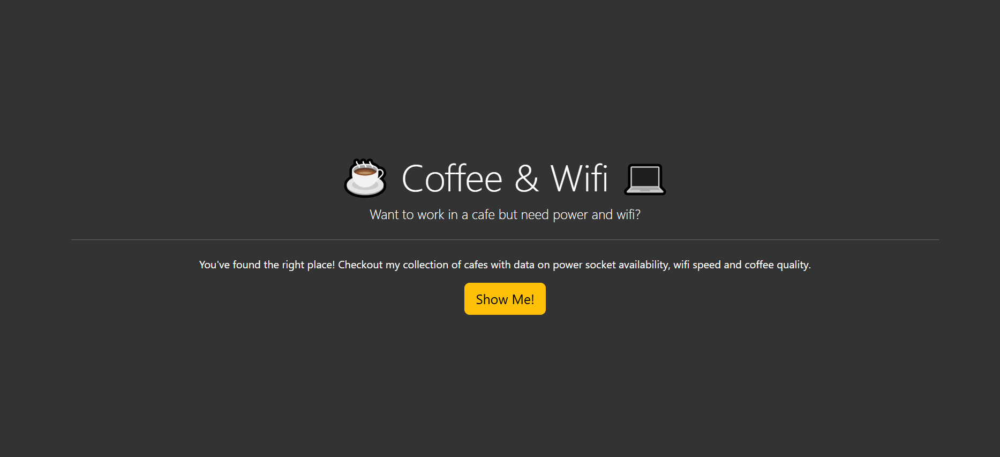
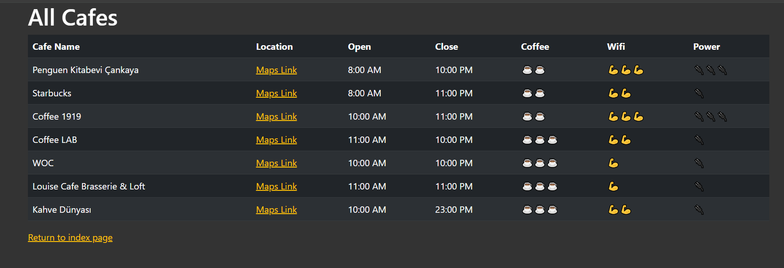
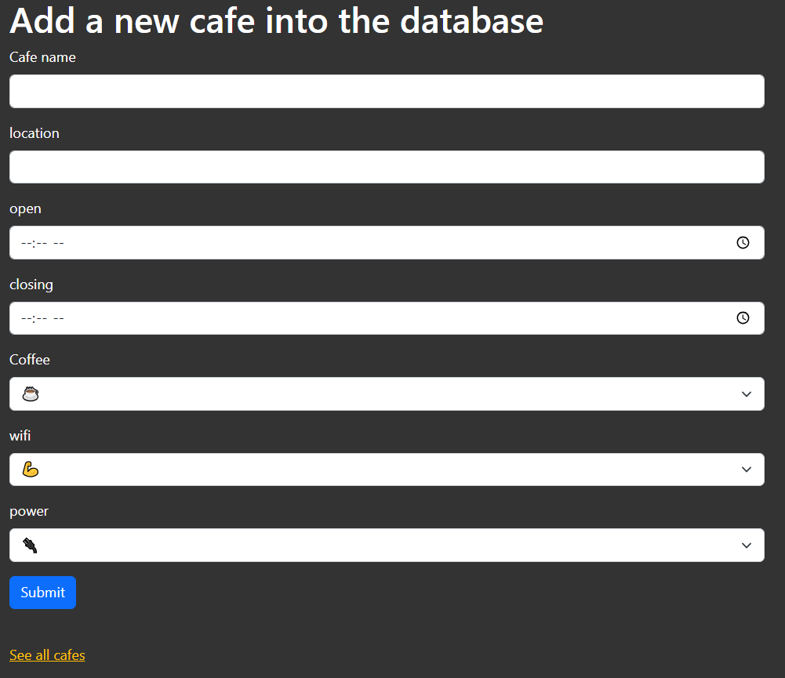
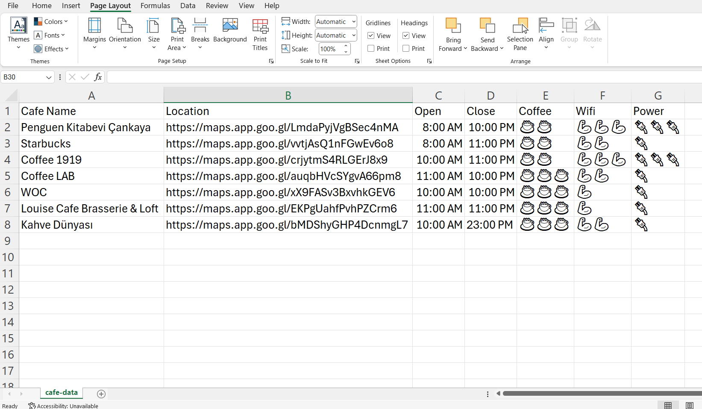

## Day 62 – Flask Cafe Website ⋆☕︎ ˖ 📶 🔌

Built a simple multi-page web application to manage a list of local cafes using **Flask, Jinja, HTML/CSS, Bootstrap, and WTForms**.  
Used the **CSV module** to store cafe data as a lightweight database.  

### Features 🛠️
- **Client-facing page** to view cafes in a table format.  
- **Hidden admin page** to add new cafes via a form.  
- **Bootstrap styling** and **form validation** for a clean, responsive interface.  

### Screenshots 🌆

**Client Page (Homepage)**

**Client Page (Cafes)**

**Admin Page (Add Cafe)**

**CSV Database**

